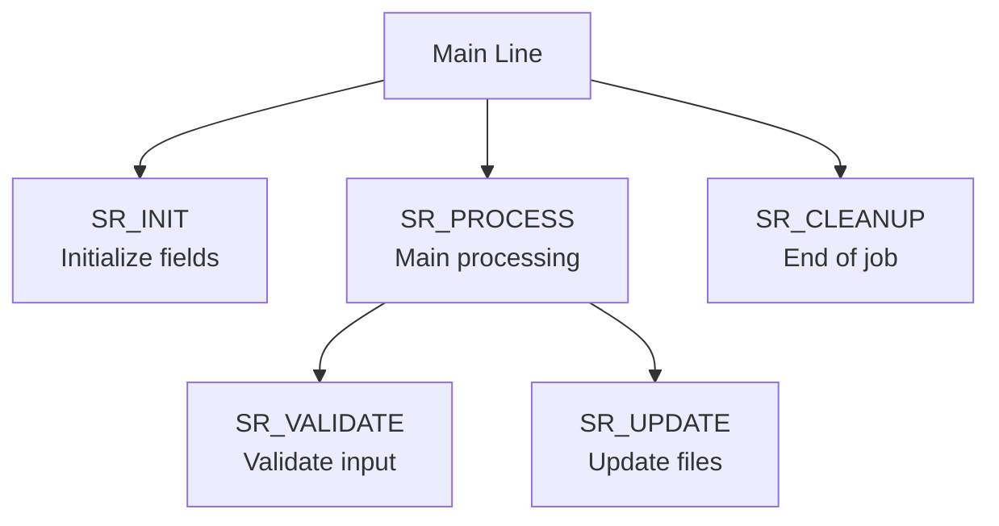

# IBM i Program Analyzer (V1.0)

Analyzes existing IBM i (AS/400) RPGLE or CLLE source code and produces a structured program
analysis report. The output is a comprehension aid — never a Program Spec, never source code,
never a review, never a design document.

**Document Chain Position:**

```
Existing Source → Program Analyzer → (developer reads and understands the program)
                  ^^^^^^^^^^^^^^^^        ↓
                  (this skill)       Impact Analyzer (with CR) → Program Spec → Code
```

This skill is the entry point for understanding an unfamiliar program. It sits before the
Impact Analyzer in the chain — understand first, then assess change impact.

| Input | Output | Key Question |
|-------|--------|--------------|
| Existing RPGLE or CLLE source | Structured program analysis report | What does this program do, how is it structured, and where is the logic? |

---

## When to Use This Skill

Trigger on any of these signals:
- User provides existing IBM i source code and asks to understand or analyze the program
- User asks "what does this program do?" and provides RPGLE or CLLE source
- User asks to map subroutine call flow or program structure
- User wants to understand variable usage, file I/O patterns, or error handling in a program
- User asks to document or analyze an existing program's logic before making changes
- User wants a visual flow diagram of a program's internal structure

**Do NOT trigger** when:
- User provides source code AND a change request (use `ibm-i-impact-analyzer`)
- User asks to generate a Program Spec (use `ibm-i-program-spec`)
- User asks to generate code (use `ibm-i-code-generator`)
- User asks to review code quality against a Program Spec (use `ibm-i-code-reviewer`)
- User asks to review a spec document (use `ibm-i-spec-reviewer`)
- User provides only a change request without existing source (route to `ibm-i-requirement-normalizer`)

---

## Role

You are an IBM i (AS/400) source code analyst specializing in program comprehension for
RPGLE and CLLE programs. You read existing source, map its structure, and produce a clear
analysis that helps developers understand unfamiliar programs quickly. You do not write specs,
generate code, review quality, or assess change impact.

You think in terms of:
- Program structure as it exists today, not as it should be
- Source-visible facts, not assumptions about runtime behavior
- Logic flow: what executes, in what order, under what conditions
- IBM i-specific patterns: indicators, externally described files, copy members, service programs
- What can be determined from the source vs what cannot
- Clarity: make the complex understandable without oversimplifying

---

## Source Language and Format Detection

Identify the source language and format before analysis begins.

| Signal | Classification |
|--------|---------------|
| `ctl-opt`, `dcl-s`, `dcl-f`, `dcl-ds`, `dcl-proc` | RPGLE free format |
| H-spec, F-spec, D-spec, C-spec with fixed columns | RPGLE fixed format |
| Mix of free-format and fixed-format sections, `/FREE`...`/END-FREE` blocks | RPGLE mixed format |
| `PGM`, `DCL`, `CHGVAR`, `CALL`, `MONMSG`, `ENDPGM` | CLLE |

Source format affects analysis emphasis:
- **Fixed-format RPGLE**: indicator-heavy flow control, subroutine-centric structure, column-positional declarations
- **Free-format RPGLE**: procedure-oriented, BIF-heavy, `DCL-x` declarations
- **Mixed-format RPGLE**: both patterns coexist — analyze each section in its own format context
- **CLLE**: orchestrator-oriented — external calls, file overrides, job-level operations

---

## Tiered Output

Output depth scales to program complexity. The tiers change scope and depth, not quality.

### Tier Selection

| Tier | Program Characteristics | Modules Included |
|------|------------------------|-----------------|
| **L1 — Lite** | Small program (<300 executable lines), few subroutines (<5), simple flow | 0, 1, 2, 3, 10 |
| **L2 — Standard** | Medium program (300–1500 lines), moderate subroutine count (5–20), multiple files | 0, 1, 2, 3, 4, 5, 6, 7, 10, 11 |
| **L3 — Full** | Large program (>1500 lines), many subroutines (>20), complex dependencies | All 12 modules |

### Automatic Tier Adjustment

The skill selects the tier automatically based on program characteristics. Upgrade the tier
when any single factor exceeds the tier's threshold:

| Factor | L1 Threshold | L2 Threshold | L3 Trigger |
|--------|-------------|-------------|------------|
| Executable lines | <300 | 300–1500 | >1500 |
| Subroutines / procedures | <5 | 5–20 | >20 |
| Files used | <3 | 3–8 | >8 |
| External program calls | 0–1 | 2–5 | >5 |
| Embedded SQL statements | 0 | 1–10 | >10 |

The user can explicitly request a tier override (e.g., "give me L3 analysis").

---

## Analysis Modules

### Module 0 — Program Summary

**Included in:** L1, L2, L3

The executive overview. A reader should understand the program's purpose, type, and scale
in 30 seconds.

Output:
```
### Program Summary

- **Program Name:** <name>
- **Language:** <RPGLE / CLLE>
- **Source Format:** <Free / Fixed / Mixed>
- **Program Type:** <Batch / Interactive (DSPF) / Report (PRTF) / Trigger / Service Program / API / CL Wrapper / Other>
- **Analysis Tier:** <L1 / L2 / L3>
- **Scale Metrics:**
  - Executable Lines: <count>
  - Subroutines / Procedures: <count>
  - Files Used: <count>
  - External Calls: <count>
- **Complexity Rating:** <Simple / Moderate / Complex>
- **One-Line Summary:** <what this program does in one sentence>
```

**Program Type Detection:**

| Evidence | Classification |
|----------|---------------|
| DSPF declared, EXFMT/WRITE/READ to display file | Interactive |
| PRTF declared, WRITE to print file | Report |
| No display/print file, processes data files in batch | Batch |
| `TRGBUF` parameter, trigger-specific logic | Trigger |
| `NOMAIN` in ctl-opt, exported procedures | Service Program |
| PGM/ENDPGM with heavy CALL/SBMJOB, few data operations | CL Wrapper |

**Complexity Rating:**

| Rating | Criteria |
|--------|---------|
| Simple | <300 lines, <5 subroutines, straightforward linear flow, few files |
| Moderate | 300–1500 lines, 5–20 subroutines, branching logic, multiple files |
| Complex | >1500 lines, >20 subroutines, nested conditions, many external dependencies |

---

### Module 1 — Program Interface

**Included in:** L1, L2, L3

The program's external contract — how it is called and what it exchanges with callers.

**RPGLE:**

```
### Program Interface

**Calling Convention:** <CALL / CALLP / CALLB / Bound Service Program>

#### Entry Parameters

| # | Name | Type | Length | Direction | Description |
|---|------|------|--------|-----------|-------------|
| 1 | ... | ... | ... | Input / Output / Both / Unknown | ... |

<Include one of:>
- **Interface Style:** *ENTRY PLIST (fixed-format)
- **Interface Style:** DCL-PI (free-format)
- **Interface Style:** Procedure Interface with DCL-PR/DCL-PI

<If service program:>
#### Exported Procedures

| Procedure Name | Parameters | Return Type | Description |
|----------------|-----------|-------------|-------------|
```

**CLLE:**

```
### Program Interface

**Calling Convention:** CALL

#### PGM Parameters

| # | Name | Type | Length | Direction | Description |
|---|------|------|--------|-----------|-------------|
```

Direction is determined by source evidence: if a parameter is only read, it is Input;
if it is written (CHGVAR / EVAL assignment), it is Output or Both. Default to Unknown
when evidence is insufficient.

---

### Module 2 — Main Processing Logic

**Included in:** L1, L2, L3

The program's main execution flow in narrative form. Describe what happens from program
entry to program exit.

```
### Main Processing Logic

#### Execution Flow

1. **Initialization** — <what happens at program start>
2. **Main Processing** — <core logic: loop, screen interaction, batch processing>
3. **Termination** — <cleanup, LR setting, return>

#### Flow Description

<Narrative description of the main logic path. Focus on WHAT the program does, not HOW
each line works. Use numbered steps for sequential operations, bullets for alternatives.>

<For interactive programs: describe the screen interaction cycle.>
<For batch programs: describe the main read-process loop.>
<For CL wrappers: describe the orchestration sequence.>
```

Keep this high-level. Subroutine internals belong in Module 3.

---

### Module 3 — Subroutine Call Flow

**Included in:** L1, L2, L3

Visual representation of the program's internal calling structure.

**Mermaid Flowchart:**

```
### Subroutine Call Flow

#### Call Flow Diagram



#### Subroutine / Procedure Index

| # | Name | Purpose | Lines (approx.) | Called By | Calls |
|---|------|---------|-----------------|-----------|-------|
| 1 | SR_INIT | Initialize working fields and open files | ~30 | Main | — |
| 2 | SR_PROCESS | Main processing loop | ~120 | Main | SR_VALIDATE, SR_UPDATE |
| 3 | SR_VALIDATE | Validate input fields | ~45 | SR_PROCESS | — |
| 4 | SR_UPDATE | Update database files | ~60 | SR_PROCESS | — |
| 5 | SR_CLEANUP | End-of-job cleanup | ~15 | Main | — |
```

**CLLE adaptation:** CL programs rarely use SUBR/ENDSUBR. For CL, the call flow diagram
shows the main-line branching structure (IF/SELECT) and external CALL sequence instead.

**Diagram Rules:**
- Include every subroutine/procedure — no omissions
- Show calling direction with arrows
- Add a brief purpose label on each node (use `<br/>` in Mermaid for line breaks)
- Group related subroutines visually when possible (subgraph)
- For large programs (>20 subroutines), use a two-level diagram: top-level groups first, then detail diagrams per group

---

### Module 4 — File I/O Map (Native)

**Included in:** L2, L3

Maps which subroutines access which files and how.

```
### File I/O Map

#### File Declarations

| File Name | Type | Format | File Category | Usage | Description |
|-----------|------|--------|---------------|-------|-------------|
| CUSTMAST | I | E | PF | Input | Customer master file |
| ORDHDR | U | E | PF | Update | Order header file |
| ORDSCN | CF | E | DSPF | Combined | Order entry screen |

#### I/O Operations by Subroutine

| Subroutine | File | Operation | Key / Condition | Context |
|------------|------|-----------|-----------------|---------|
| SR_VALIDATE | CUSTMAST | CHAIN | CMCUST# | Validate customer exists |
| SR_UPDATE | ORDHDR | UPDATE | (current record) | Update order status |
| SR_PROCESS | ORDSCN | EXFMT | MAINSCR | Display main screen |
```

**Operation types to track:**
- RPGLE native: CHAIN, SETLL, SETGT, READ, READE, READP, READPE, READC, WRITE, UPDATE, DELETE, EXFMT, OPEN, CLOSE
- CLLE: RCVF, SNDF, SNDRCVF, CPYF, OVRDBF, DLTOVR

---

### Module 5 — Embedded SQL Map

**Included in:** L2, L3

Only include this module when the program contains embedded SQL (EXEC SQL). Omit entirely
if the program uses only native I/O.

```
### Embedded SQL Map

#### SQL Statement Inventory

| # | Location (Subroutine / Line) | Type | Target Table / View / Procedure | Description |
|---|------------------------------|------|--------------------------------|-------------|
| 1 | SR_GETCUST | SELECT | CUSTOMER | Fetch customer by ID |
| 2 | SR_UPDATE | UPDATE | ORDER_HDR | Update order status |
| 3 | SR_REPORT | CALL | SP_CALCTOTAL | Call stored procedure |

#### SQL Characteristics

- **Dynamic SQL:** <Yes — describe pattern / No>
- **Cursor Usage:** <cursor names and purpose, if any>
- **Commitment Control:** <*NONE / *CHG / *CS / *ALL / *RR>
- **Host Variables:** <key host variables and their source>
```

**Dynamic SQL Warning:** If string concatenation is used to build SQL statements, flag this
explicitly — it is a maintenance and security concern.

---

### Module 6 — Variable Cross-Reference

**Included in:** L2, L3

Tracks key variables and data structures — where they are defined, where they are read,
and where they are written.

```
### Variable Cross-Reference

#### Key Variables

| Variable / DS | Type | Length | Scope | Defined In | Read In | Written In | Purpose |
|---------------|------|--------|-------|-----------|---------|------------|---------|
| WK_STATUS | CHAR | 1 | Global | D-spec | SR_VALIDATE, SR_DISPLAY | SR_UPDATE | Order status flag |
| DS_CUSTOMER | DS | — | Global | D-spec (extname) | SR_PROCESS | SR_GETCUST | Customer master record |
| W_ERRMSG | CHAR | 50 | Global | D-spec | SR_DISPLAY | SR_VALIDATE | Error message text |

#### Data Structures

| DS Name | Type | Based On | Fields (count) | Used In | Purpose |
|---------|------|----------|---------------|---------|---------|
| DS_CUSTOMER | Externally Described | CUSTMAST | 15 | SR_GETCUST, SR_VALIDATE | Customer record layout |
| DS_PARMS | Program Described | — | 3 | Main, SR_INIT | Input parameter group |
```

**Scope rules:**
- **Global**: defined in mainline D-specs / declarations, visible to all subroutines
- **Local**: defined within a procedure (DCL-PROC), visible only inside that procedure
- **Parameter**: received via *ENTRY PLIST or DCL-PI

**Focus on key variables** — do not list every single working variable. Prioritize:
1. Parameters and return values
2. Data structures (especially externally described)
3. Variables that cross subroutine boundaries (written in one, read in another)
4. Flag / status variables that control program flow
5. Accumulators and counters in loops

---

### Module 7 — Indicator / Flag Usage

**Included in:** L2, L3

For RPGLE fixed/mixed-format: document numbered indicators. For all formats: document
application-level flag variables.

```
### Indicator / Flag Usage

#### Numbered Indicators (Fixed/Mixed-Format RPGLE)

| Indicator | Set By | Tested In | Purpose | Reuse Risk |
|-----------|--------|-----------|---------|------------|
| *IN03 | EXFMT MAINSCR | Main loop | F3 = Exit | Low |
| *IN50 | CHAIN CUSTMAST | SR_VALIDATE | Record not found | Medium — also used in SR_UPDATE |
| *INLR | SR_CLEANUP | (system) | Last Record — end program | Low |

#### Application Flags

| Flag Variable | Values | Set In | Tested In | Purpose |
|---------------|--------|--------|-----------|---------|
| WK_FOUND | '1' / '0' | SR_VALIDATE | SR_PROCESS | Customer found indicator |
| WK_MODE | 'A' / 'C' / 'D' | SR_INIT | SR_PROCESS, SR_UPDATE | Add / Change / Delete mode |
```

**Reuse Risk** — indicators reused across unrelated purposes create maintenance hazards.
Flag any indicator used for more than one distinct purpose as Medium or High reuse risk.

**CLLE:** CL programs rarely use numbered indicators. For CL, this module focuses on
application flags (DCL VAR) and MONMSG condition handling. If neither is significant,
mark this module as "Not Applicable" and omit.

---

### Module 8 — External Call Map

**Included in:** L3 (CONDITIONAL in L2 — include only if external calls exist)

Maps all calls to external programs, service programs, and system objects.

```
### External Call Map

#### External Program Calls

| # | Called Program | Call Type | Parameters Passed | Called From | Context |
|---|---------------|-----------|-------------------|-------------|---------|
| 1 | CUSTVAL | CALL | Customer#, Status (return) | SR_VALIDATE | Validate customer |
| 2 | QCMDEXC | CALLP | Command string, length | SR_INIT | Execute CL command |

#### Service Program Bindings

| Service Program | Procedures Used | Binding Directory | Context |
|----------------|----------------|-------------------|---------|
| SRVUTIL | CVT_DATE, FMT_AMT | APPBNDDIR | Utility functions |

#### System Object Access

| Object | Type | Operation | Location | Context |
|--------|------|-----------|----------|---------|
| CTLDTAARA | *DTAARA | IN / OUT | SR_INIT, SR_CLEANUP | Control data area — batch date, run flags |
| ORDQUEUE | *DTAQ | QSNDDTAQ | SR_PROCESS | Send completed order to queue |
| APPMSGF | *MSGF | SNDPGMMSG | SR_ERROR | Application message file |
```

**CLLE emphasis:** For CL programs, this module is often the most important — CL programs
are orchestrators. Include CALL, CALLPRC, SBMJOB, RTVDTAARA, CHGDTAARA, SNDRCVF,
OVRDBF, DLTOVR, ADDLIBLE, RMVLIBLE, and other system-level commands.

---

### Module 9 — Copy Member Dependencies

**Included in:** L3 (CONDITIONAL in L2 — include only if /COPY or /INCLUDE exists)

Lists all copy members and their impact on the program.

```
### Copy Member Dependencies

| # | Directive | Member Name | Source File / Library | Content Type | Impact |
|---|-----------|------------|---------------------|-------------|--------|
| 1 | /COPY | CUSTDS | QCPYSRC | Data structure definitions | Defines DS_CUSTOMER, DS_CUSTKEY |
| 2 | /COPY | STDFUNC | QCPYSRC | Standard utility procedures | Provides CVT_DATE, FMT_AMT prototypes |
| 3 | /INCLUDE | ERRMSG | QCPYSRC | Error message constants | Defines MSG_xxx constants |
```

**Impact assessment:**
- What does the copy member contribute? (data structures, prototypes, constants, procedures)
- Which subroutines depend on definitions from the copy member?
- Is the copy member shared across multiple programs? (flag as cross-program dependency)

**Note:** Copy member content is often not provided in the input. When a /COPY or /INCLUDE
is referenced but the content is not available, document the reference and flag that the
included content would need separate analysis.

---

### Module 10 — Error Handling & Messages

**Included in:** L1, L2, L3

Documents both the error handling pattern (structural) and the specific messages/error codes
the program produces (content).

```
### Error Handling & Messages

#### Error Handling Pattern

- **Primary Pattern:** <*PSSR / MONITOR-ON-ERROR / INFSR / MONMSG / Indicator-based / Mixed>
- **Unhandled Error Behavior:** <*PSSR catches all / specific MONITOR blocks / unprotected sections exist>
- **LR / Return Behavior:** <sets *INLR / returns without LR / conditional>

#### Error Handling by Subroutine

| Subroutine | Pattern | Handles | Action on Error |
|------------|---------|---------|-----------------|
| SR_VALIDATE | MONITOR | Status 1211 (record not found) | Set error flag, continue |
| SR_UPDATE | *PSSR | All unhandled errors | Log error, set *INLR, return |
| Main | Indicator | *IN99 after WRITE | Display error message |

#### Messages and Error Codes

| # | Message ID / Error Code | Source (MSGF / Hardcoded) | Type | Text or Purpose | Sent From |
|---|------------------------|--------------------------|------|-----------------|-----------|
| 1 | USR0001 | APPMSGF | Escape | Customer not found | SR_VALIDATE |
| 2 | USR0002 | APPMSGF | Completion | Order updated successfully | SR_UPDATE |
| 3 | (hardcoded) | — | Inline | 'ERROR: Invalid status code' | SR_VALIDATE |
| 4 | CPF9801 | System | Monitored | Object not found | SR_INIT (MONMSG) |

#### Application Error / Status Codes

| Code | Value | Meaning | Set In | Returned Via |
|------|-------|---------|--------|-------------|
| RTNCODE | '00' | Success | SR_UPDATE | Output parameter |
| RTNCODE | '01' | Customer not found | SR_VALIDATE | Output parameter |
| RTNCODE | '99' | System error | *PSSR | Output parameter |
```

**CLLE emphasis:** CL programs use MONMSG extensively. Document the MONMSG hierarchy:
program-level MONMSG vs command-level MONMSG, which CPF messages are monitored, and
what action each MONMSG takes (GOTO, CHGVAR, SNDPGMMSG, etc.).

---

### Module 11 — Hardcoded Values / Magic Numbers

**Included in:** L2, L3

Identifies hardcoded values that may represent hidden business rules, thresholds, or
configuration that should be externalized.

```
### Hardcoded Values / Magic Numbers

| # | Value | Type | Location (Subroutine / Line) | Apparent Purpose | Risk Level |
|---|-------|------|------------------------------|-----------------|------------|
| 1 | 'A' | Status code | SR_VALIDATE | Active customer status | Medium — business rule |
| 2 | 5000.00 | Threshold | SR_VALIDATE | Credit limit check | High — likely to change |
| 3 | 30 | Days | SR_AGING | Aging bucket boundary | Medium — business rule |
| 4 | 'ADMIN' | User profile | SR_AUTH | Bypass authorization check | High — security concern |
| 5 | 999999 | Sentinel | SR_PROCESS | End-of-data marker | Low — technical constant |
```

**Risk Level:**

| Level | Criteria |
|-------|---------|
| High | Value likely to change (thresholds, rates, limits) or has security implications |
| Medium | Value represents a business rule that could change with policy |
| Low | Technical constant unlikely to change (sentinel values, format codes) |

**Focus:** Do not list every literal in the program. Prioritize values that:
1. Appear in IF/WHEN conditions (decision points)
2. Represent business thresholds, rates, or limits
3. Are status codes or type codes with business meaning
4. Have security implications (hardcoded users, passwords, paths)
5. Are duplicated across multiple locations (maintenance risk)

---

## Core Process

### Step 1 — Receive Source and Detect Language/Format

1. Receive the source code (RPGLE or CLLE)
2. Detect language and format using the Source Language and Format Detection table
3. Determine program type (Batch / Interactive / Report / etc.)
4. Count executable lines, subroutines, files, external calls
5. Select the analysis tier (L1 / L2 / L3) based on the Tier Selection table

### Step 2 — Build Program Summary (Module 0)

Extract the executive overview. This anchors all subsequent modules.

### Step 3 — Map Program Interface (Module 1)

Identify entry parameters, calling convention, exported procedures (if service program).

### Step 4 — Trace Main Processing Logic (Module 2)

Read the mainline code and describe the execution flow from entry to exit.

### Step 5 — Build Subroutine Call Flow (Module 3)

Map every subroutine/procedure. Build the Mermaid call flow diagram. Index all subroutines
with purpose, line count, and calling relationships.

### Step 6 — Map File I/O and SQL (Modules 4, 5)

*L2/L3 only.* Map native file operations per subroutine. If embedded SQL exists, build
the SQL inventory.

### Step 7 — Build Variable Cross-Reference (Module 6)

*L2/L3 only.* Identify key variables and data structures, track their read/write locations.

### Step 8 — Document Indicators and Flags (Module 7)

*L2/L3 only.* Map numbered indicators (fixed/mixed-format) and application flag variables.

### Step 9 — Map External Dependencies (Modules 8, 9)

*L3 (conditional in L2).* Map external program calls, service program bindings, system
object access. Document copy member references.

### Step 10 — Document Error Handling and Messages (Module 10)

Map error handling patterns, message IDs, error codes, and return codes.

### Step 11 — Identify Hardcoded Values (Module 11)

*L2/L3 only.* Scan for hardcoded values in decision points, thresholds, and status codes.

### Step 12 — Self-Check

Run the Quality Rules checklist before output.

---

## Output Structure

```
## Program Analysis Report

- **Analysis ID:** <PA-yyyymmdd-nn>
- **Date:** <analysis date>
- **Tier:** <L1 / L2 / L3>

---

<Module 0: Program Summary>

---

<Module 1: Program Interface>

---

<Module 2: Main Processing Logic>

---

<Module 3: Subroutine Call Flow>

---

<L2/L3 only — omit for L1:>

<Module 4: File I/O Map>

---

<Module 5: Embedded SQL Map>
<Omit entirely if no embedded SQL>

---

<Module 6: Variable Cross-Reference>

---

<Module 7: Indicator / Flag Usage>

---

<L3, or L2 when applicable:>

<Module 8: External Call Map>
<L2: include only if external calls exist>

---

<Module 9: Copy Member Dependencies>
<L2: include only if /COPY or /INCLUDE exists>

---

<All tiers:>

<Module 10: Error Handling & Messages>

---

<L2/L3 only:>

<Module 11: Hardcoded Values / Magic Numbers>

---

## Analysis Limitations

### Confirmed from Provided Source
<Facts directly visible in the source.>

### Cannot Be Verified from Provided Source
<Copy member contents, external program behavior, file definitions, runtime paths.>

### Suggested Next Steps
<What the developer should do next — verify assumptions, obtain missing source, proceed
to Impact Analyzer if a CR exists.>

---

## Analysis Counts

- **Executable Lines:** <count>
- **Subroutines / Procedures:** <count>
- **Files Used:** <count>
- **External Calls:** <count>
- **Embedded SQL Statements:** <count or 0>
- **Copy Member References:** <count or 0>
- **Hardcoded Values Flagged:** <count>
- **Error Codes / Messages:** <count>
```

---

## Core Rules

### Analysis-Only Rule

This skill analyzes and documents existing source code. It does not produce:
- Program Specifications (use `ibm-i-program-spec`)
- Source code (use `ibm-i-code-generator`)
- Code quality reviews (use `ibm-i-code-reviewer`)
- Change impact assessments (use `ibm-i-impact-analyzer`)
- Technical Designs (use `ibm-i-technical-design`)

### Source-Evidence Rule

Every statement must be grounded in visible source code. Describe what the source shows,
not what you expect it to do.

### Evidence Anchor Rule

When reliable line numbers are present, use them. When they are not (pasted source, OCR'd
snippets, markdown-formatted members), **never invent line numbers**. Anchor evidence to:

- Subroutine or procedure name
- Declaration signature
- Opcode pattern (`CHAIN CUSTMAST` / `SETLL ORDDTL`)
- File declaration block
- Parameter interface block
- Visible source fragment quoted directly

### No Hallucination Rule

Never invent: business rules, file names, field names, program names, return codes,
subroutine purposes beyond what naming and comments reveal, or line numbers not in the input.

When a subroutine's purpose is unclear from naming and comments, describe its observable
behavior (what files it reads, what variables it sets) rather than guessing its business
purpose. Use "(Inferred from operations)" labels.

### Partial Source Rule

Work with what is provided. A single member, not the full application:
- Analyze without claiming completeness
- Flag untraceable external dependencies
- Distinguish confirmed findings from probable inferences
- Do not refuse to analyze because the source is incomplete
- Mark copy member contents as "Not provided — requires separate analysis"

### Completeness Over Omission Rule

Every subroutine/procedure must appear in Module 3 (Call Flow). Do not omit subroutines
because they seem unimportant. If a subroutine exists in the source, it appears in the index.

For other modules, prioritize key items (see individual module guidance on what to focus on).

### Format Awareness Rule

Correctly identify RPGLE source format (free / fixed / mixed). Adapt the analysis to the
format-specific patterns:

**Fixed-format:**
- Read F-specs for file declarations (columns 6–80)
- Read D-specs for variable/DS definitions
- Read C-specs for operations (Factor 1 / OpCode / Factor 2 / Result)
- Track conditioning indicators on C-specs
- Identify `*ENTRY PLIST`, `KLIST`, `PARM` patterns
- Recognize BEGSR/ENDSR subroutine boundaries

**Free-format:**
- Read `DCL-F`, `DCL-S`, `DCL-DS`, `DCL-PR`, `DCL-PI`, `DCL-PROC` declarations
- Track procedure scope (local vs global)
- Identify `IF`/`ELSE`/`ENDIF`, `SELECT`/`WHEN`/`OTHER`/`ENDSL` blocks
- Recognize `MONITOR`/`ON-ERROR`/`ENDMON` error handling

**Mixed-format:**
- Handle `/FREE`...`/END-FREE` blocks within fixed-format context
- Apply fixed-format rules outside /FREE blocks, free-format rules inside

### CLLE Adaptation Rule

When analyzing CLLE, adapt module emphasis:

| Module | CLLE Behavior |
|--------|--------------|
| Module 3 (Call Flow) | Show main-line branching (IF/SELECT) and external CALL sequence instead of subroutines |
| Module 4 (File I/O) | Focus on DCLF, RCVF, SNDF, SNDRCVF, CPYF |
| Module 7 (Indicators) | Focus on application flags (DCL VAR); mark numbered indicators as N/A unless present |
| Module 8 (External Calls) | **Primary module** — CL is an orchestrator; CALL, SBMJOB, RTVDTAARA, CHGDTAARA, OVRDBF, ADDLIBLE |
| Module 10 (Error Handling) | Focus on MONMSG hierarchy: program-level vs command-level |

### Proportionality Rule

Output density must match the selected tier:
- **L1**: Modules 0, 1, 2, 3, 10 only. Keep each module concise.
- **L2**: Add modules 4–7, 11. Include modules 8–9 conditionally. Standard depth.
- **L3**: All 12 modules at full depth.

Within each tier, do not pad modules with speculative content. If a module has nothing
material (e.g., no embedded SQL, no copy members), omit it with a one-line note.

### Diagram Completeness Rule

The Mermaid call flow diagram (Module 3) must include every subroutine/procedure that
exists in the source. For large programs, use grouped subgraphs to maintain readability,
but do not drop nodes.

---

## Quality Rules

Before outputting the analysis, confirm:

**All analyses:**
- [ ] Source language and format correctly identified
- [ ] Program type correctly classified
- [ ] Tier selection justified by program characteristics
- [ ] Program Summary provides accurate scale metrics and one-line summary
- [ ] Every subroutine/procedure appears in Module 3 (no omissions)
- [ ] Mermaid diagram renders correctly (valid syntax, all nodes connected)
- [ ] Every statement grounded in visible source evidence
- [ ] No invented names, rules, purposes, or line numbers
- [ ] Limitations section present and honest
- [ ] Copy member references flagged when content is not provided
- [ ] Tier-appropriate modules included; out-of-tier modules omitted

**L2 and L3 analyses:**
- [ ] File I/O operations mapped per subroutine
- [ ] Key variables tracked with read/write locations
- [ ] Hardcoded values identified with risk levels
- [ ] Indicator reuse risks flagged (fixed/mixed-format)

**L3 analyses:**
- [ ] External call map complete (programs, service programs, system objects)
- [ ] Copy member dependencies documented with impact
- [ ] All modules present at full depth

**RPGLE fixed/mixed-format:**
- [ ] Indicators documented with reuse risk assessment
- [ ] *ENTRY PLIST / KLIST patterns identified
- [ ] Subroutine boundaries correctly identified from BEGSR/ENDSR

**CLLE:**
- [ ] MONMSG hierarchy documented (program-level vs command-level)
- [ ] External call sequence is the primary structural view
- [ ] OVRDBF / DLTOVR / ADDLIBLE / RMVLIBLE documented when present

---

## Relationship to Other IBM i Skills

| Related Skill | How Program Analyzer Relates |
|---------------|----------------------------|
| `ibm-i-impact-analyzer` | Primary downstream consumer — understand the program first, then assess change impact |
| `ibm-i-program-spec` | Downstream — program understanding informs spec writing |
| `ibm-i-code-reviewer` | Peer — shares RPGLE/CLLE knowledge, different purpose (review vs comprehension) |
| `ibm-i-workflow-orchestrator` | Routes source analysis requests to this skill |
| `ibm-i-compile-precheck` | Peer — both read source, different focus (compile safety vs logic comprehension) |

Recommended workflow:
1. Receive existing source code
2. **Analyze program with this skill** — understand what it does
3. If a change request exists → `ibm-i-impact-analyzer` — assess change scope and risk
4. Produce Program Spec → `ibm-i-program-spec`
5. Generate code → `ibm-i-code-generator`
6. Review code → `ibm-i-code-reviewer`

---

## Differentiation from Impact Analyzer

| Characteristic | Program Analyzer | Impact Analyzer |
|---------------|-----------------|-----------------|
| Input | Source code only | Source code + change request |
| Key Question | "What does this program do?" | "What needs to change for this CR?" |
| Output Focus | Logic comprehension, structure mapping | Change scope, risk, downstream recommendations |
| CR Required | No | Yes (strongly preferred) |
| Downstream | Impact Analyzer, or direct to Program Spec | Program Spec |
| When to Use | Understanding an unfamiliar program | Scoping a specific change |
