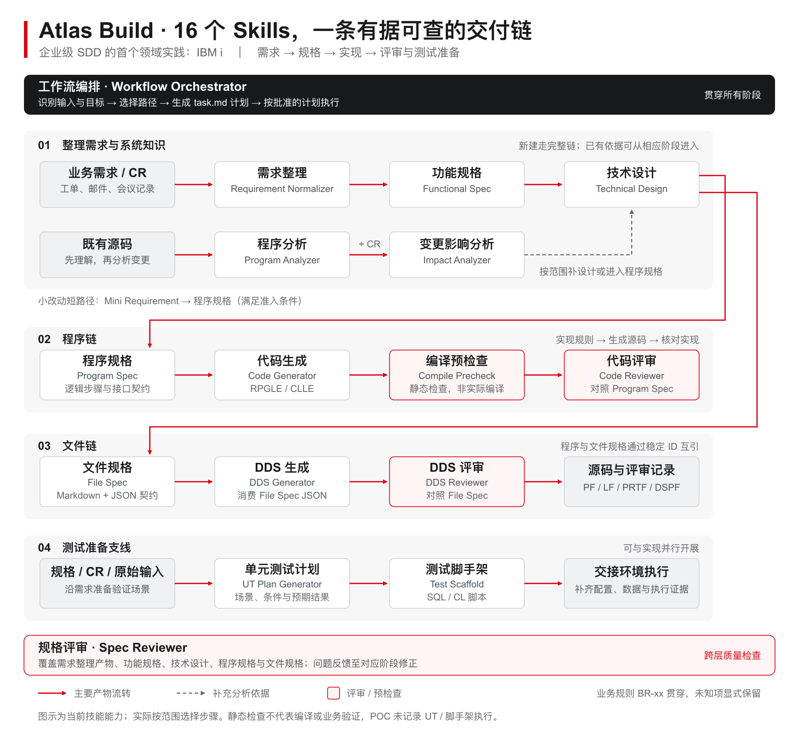

# Atlas Engineering Delivery Hub - Build

[简体中文](README.md) | **English**

[Delivery Cases](docs/cases/README.md) | [Competition Submission](docs/open-collaboration-submission.md) | [Full Skill Reference](docs/full-reference-readme.md) | [Interactive Deck (Chinese)](docs/presentations/README.md)


**Enterprise SDD (Spec-Driven Development) in practice: turn business requirements, system knowledge and engineering constraints into a traceable, reviewable and verifiable delivery process.**

IBM i is the first in-depth practice context, with 16 domain skills and synthetic POC evidence. The project explores transferable delivery methods; adaptation and validation for other technology environments remain future work.

## Situation — Why Build This?

Long-lived enterprise software accumulates business rules, system dependencies and team conventions. The question we address is how AI can use that knowledge to produce implementation work whose rules and constraints reviewers can check.

In the first IBM i practice context, changes require understanding existing source, checking file and calling contracts, and preserving maintenance conventions. The [pilot retrospective](article-pilot-retrospective.md) records three usability problems: a full document chain burdened small changes; generated fixed-format code lacked familiar structure, comments and naming; existing-code analysis and test preparation were missing from the workflow. These observations informed the product changes; their cost has not been measured.

## Solution — How Does It Help?

- **Choose the path by scope:** small changes with sufficient context retain necessary specifications and checks; new work or unclear scope first establishes requirement and design evidence.
- **Make domain knowledge explicit:** existing-system knowledge, processing steps, interface and data contracts, and team conventions guide generation and review.
- **Deliver checking evidence with implementation:** retain BR identifiers and cross-spec references, then use review rules, static checks and human judgment to assess artifacts.

These mechanisms form the enterprise SDD practice approach. The first IBM i implementation applies them through the Mini Requirement → Program Spec fast path, program/file contracts, and RPGLE, CLLE and DDS generation and review rules. The intended benefits are less repeated understanding and correction work, and reusable maintenance knowledge; real-case comparisons will test those benefits.

## Result — What Is Established?

The [complete synthetic POC](docs/cases/rpgle-flow-poc/README.md) contains requirements, design, 8 program specs, 24 file specs and 35 source files. Its 32 business rules link to specification steps and source locations; 94 steps have static locations, with checks and recorded corrections. Reviewers can follow implementation evidence by rule, and others can recheck the current static materials locally.

There are no IBM i compilation, business-execution or measured productivity results yet. Artifact counts and static locations do not establish business correctness. Anonymized real cases will measure **total human effort, rework and handoff quality**.

The [Situation → Solution → Result narrative and measurement approach](docs/atlas-engineering-delivery-hub-build-pitch.md) is the maintained value story; the [case library](docs/cases/README.md) holds supporting evidence.


## Method And Domain Practice

| Layer | Purpose | Current status |
| --- | --- | --- |
| Enterprise delivery problems | Understand context, bound changes and locate rule implementations | Grounded in pilot feedback and case findings |
| SDD practice method | Layered specifications, explicit contracts, rule traceability, human confirmation and validation feedback | Protocols, templates and review rules exist |
| Domain implementation | Apply the method through specific generation and checking capabilities | IBM i first; other technology stacks await adaptation and validation |

A new domain needs its own contracts, generation conventions, review rules and validation tools, followed by case evidence. See the [domain expansion approach](docs/atlas-engineering-delivery-hub-build-pitch.md#领域扩展路线).

## Current Delivery Scope

This repository is the **M4 Build tool** within Atlas Engineering Delivery Hub / Seven Mountains SDLC. Upstream M3 Discovery capabilities, such as Atlas Phoenix Lens / Legacy Spec Factory, can supply discovery and design evidence; Build prepares implementation and developer-test artifacts for downstream M5 Testing.

```text
M1 Planning -> M2 Estimation -> M3 Discovery -> [M4 Build] -> M5 Testing -> M6 Deployment -> M7 Maintenance
```

The repo currently delivers **16 IBM i Agent Skills** in the [skill directory](agent-skills/). The skills cover two connected delivery chains:

- **Program Chain:** requirements/design evidence -> Program Spec -> RPGLE/CLLE source -> compile precheck -> code review -> unit test plan -> SQL/CL test scaffold.
- **File Chain:** technical design/file requirements -> File Spec with Markdown + JSON -> DDS source for PF/LF/PRTF/DSPF -> DDS review.
- **Analysis and Routing:** existing source analysis, impact analysis, spec review, and workflow orchestration including task.md planning and approved batch execution.

The repository contains skill definitions, references, examples, diagrams, semi-automated test harnesses, and delivery cases with source drafts and validation evidence. It does **not** contain an application server, IBM i connector, or automatic deployment runtime.

## Delivery Cases

The [case library](docs/cases/README.md) currently includes a [synthetic multi-warehouse order fulfillment and settlement POC](docs/cases/rpgle-flow-poc/README.md), imported from a pinned version of `rpgle-migration-benchmark`. Its requirements, design, 8 program specs, 24 file specs, 35 source files, static review records, and frozen flow-analysis benchmark materials are available in this repository.

The case demonstrates use of the skill family through source-draft generation and static checks. It has no IBM i compilation, business-execution, model-evaluation, or productivity-comparison results. Future anonymized real delivery cases will use the [same case template](docs/cases/case-template.md), with their origin and actual verification evidence stated separately.

## Main Capabilities



[Open scalable SVG](docs/assets/atlas-build-skill-map.zh-CN.svg) · [Diagram notes and sources](docs/assets/atlas-build-skill-map.zh-CN.md). The map covers the 16 existing skills. Select steps by scope; eligible small changes can enter Program Spec from a Mini Requirement. Test preparation can run in parallel. This capability map does not imply that every step was executed in the POC.

| Area | Skills | Delivered behavior |
|------|--------|--------------------|
| Intake and analysis | `ibm-i-requirement-normalizer`, `ibm-i-program-analyzer`, `ibm-i-impact-analyzer` | Normalize messy input, understand existing RPGLE/CLLE source, and assess source-level change impact. |
| Specification | `ibm-i-functional-spec`, `ibm-i-technical-design`, `ibm-i-program-spec`, `ibm-i-file-spec` | Produce tiered functional, technical, program, and DDS file specs with BR-xx traceability and TBD handling. |
| Build artifact generation | `ibm-i-code-generator`, `ibm-i-dds-generator` | Generate RPGLE/CLLE source from Program Specs and DDS source from File Spec JSON contracts. |
| Validation gates | `ibm-i-compile-precheck`, `ibm-i-spec-reviewer`, `ibm-i-dds-reviewer`, `ibm-i-code-reviewer` | Review compile safety, spec quality, DDS alignment, and code/spec alignment. |
| Developer testing | `ibm-i-ut-plan-generator`, `ibm-i-test-scaffold` | Produce unit test plans and executable SQL/CL scaffold scripts for setup, compile, execute, verify, and cleanup. |
| Orchestration | `ibm-i-workflow-orchestrator` | Route one-step workflows or generate/execute approved `task.md` batch plans. |

## Inputs And Outputs

Typical inputs:

- Raw change requests, tickets, emails, meeting notes, or mini requirements.
- Existing RPGLE/CLLE source members and change requests.
- Functional Specs, Technical Designs, Program Specs, File Specs, or File Spec JSON.
- Unit Test Plans or test scenarios for IBM i delivery.

Typical outputs:

- Normalized requirement packages.
- Functional Specs, Technical Designs, Program Specs, and File Specs.
- RPGLE or CLLE source drafts and DDS source members.
- Compile precheck, spec review, code review, and DDS review reports.
- Unit test plans and SQL/CL test scaffold packages.
- `task.md` batch plans with target artifacts, gates, execution log, open questions, and final manifest.

## How It Works

The Build tool uses evidence-preserving skill boundaries. Each skill has a narrow job and explicit rules in its own `SKILL.md`.

1. **Classify the current artifact stage.** The workflow orchestrator decides whether the team is holding raw input, discovery/design evidence, existing source, a spec, generated code, or a test plan.
2. **Generate only from the right source of truth.** Code generation requires a Program Spec. DDS generation requires File Spec JSON. Review skills assess artifacts and do not rewrite them.
3. **Preserve traceability.** Business rules keep BR-xx identifiers across layers. File Specs expose stable IDs so Program Specs can link to file and field references.
4. **Mark uncertainty instead of inventing detail.** Unknown object names, missing file layouts, and unresolved design facts become `TBD` or labeled inferences.
5. **Insert human gates.** Plan approval, spec approval, reviewer Critical findings, and unresolved blocking TBDs are explicit stop points.

See the architecture visuals:

- [Lifecycle positioning](docs/assets/atlas-build-lifecycle.mmd)
- [Internal workflow](docs/assets/atlas-build-internal-workflow.mmd)
- [Upstream/downstream relationship](docs/assets/atlas-build-upstream-downstream.mmd)

## Quick Start

1. Clone the repository.
2. Select skills from the [skill directory](agent-skills/) and install each complete folder, including `SKILL.md`, references and templates, according to your company-approved Agent tool's requirements. Alternatively, use this repository as a reference workspace. Skill discovery, tool calls and approval behavior require tool-specific verification; copying folders alone does not guarantee compatibility.
3. Start with the artifact you already have:

```text
Raw request -> ibm-i-requirement-normalizer
Existing source only -> ibm-i-program-analyzer
Existing source + CR -> ibm-i-impact-analyzer
Technical Design -> ibm-i-program-spec and/or ibm-i-file-spec
Program Spec -> ibm-i-code-generator, ibm-i-ut-plan-generator
File Spec JSON -> ibm-i-dds-generator
Generated source -> compile/code/DDS review skills
Unsure what next -> ibm-i-workflow-orchestrator
```

4. For batch delivery, ask the orchestrator to produce a `task.md` plan from an approved Program Spec or Technical Design. Review and approve the plan before execution mode.
5. Use the generated review reports, test scaffold, and final manifest as the build evidence package for downstream M5 Testing.

## Example Workflow

```text
M3 Discovery evidence
  -> Technical Design
  -> ibm-i-workflow-orchestrator Plan Mode
  -> approved task.md
  -> Program Spec and File Spec generation
  -> human Spec Approval Gate
  -> RPGLE/CLLE and DDS generation
  -> compile precheck, code review, DDS review
  -> UT Plan and SQL/CL test scaffold
  -> M5 Testing handoff
```

A small sanitized demo package is available at [docs/samples/atlas-build-tool-mini-output/](docs/samples/atlas-build-tool-mini-output/).

For a complete artifact set, follow the [RPGLE Flow POC demo path](docs/cases/rpgle-flow-poc/README.md#建议的-demo-阅读路径). Its recorded workflow stops at source drafts and static checks; the UT and scaffold steps above are not recorded as executed in this case.

## Directory Overview

The [Agent Skills directory](agent-skills/) contains 16 skills with references, templates, examples and regression harnesses. Other materials include:

```text
docs/assets/                              # Value, skill workflow and architecture visuals
docs/cases/                               # Delivery cases, evidence and contribution template
docs/cases/rpgle-flow-poc/                 # Synthetic POC with pinned artifacts and benchmark kit
docs/samples/atlas-build-tool-mini-output/ # Sanitized mini demo package
docs/full-reference-readme.md             # Preserved detailed technical README
docs/open-collaboration-submission.md     # English competition submission draft
docs/open-collaboration-submission.zh-CN.md # Chinese competition submission draft
docs/atlas-engineering-delivery-hub-build-index.md # Reviewer navigation index
docs/atlas-engineering-delivery-hub-build-pitch.md # Short pitch and demo script
OpenCode_IBMi_Skill_Family.pptx           # Existing presentation asset
```

## Key Documents

- [Delivery case library](docs/cases/README.md)
- [Reviewer index](docs/atlas-engineering-delivery-hub-build-index.md)
- [Open collaboration submission](docs/open-collaboration-submission.md)
- [中文提交材料](docs/open-collaboration-submission.zh-CN.md)
- [Pitch and demo story](docs/atlas-engineering-delivery-hub-build-pitch.md)
- [Contribution guide](CONTRIBUTING.md)
- [Original full skill reference](docs/full-reference-readme.md)
- [Workflow orchestrator skill](agent-skills/ibm-i-workflow-orchestrator/SKILL.md)
- [Task.md template](agent-skills/ibm-i-workflow-orchestrator/references/task-md-template.md)
- [Task.md execution protocol](agent-skills/ibm-i-workflow-orchestrator/references/task-md-execution-protocol.md)

## Validation And Test Harnesses

Three skills include semi-automated shell harnesses:

- [DDS generation harness](agent-skills/ibm-i-dds-generator/tests/runner.sh) with 31 DDS cases.
- [Code generation harness](agent-skills/ibm-i-code-generator/tests/runner.sh) with 8 code-generation cases.
- [Test scaffold harness](agent-skills/ibm-i-test-scaffold/tests/runner.sh) with 6 scaffold cases.

These legacy harnesses invoke a specific external Agent CLI and then apply structural checks to generated output. Their execution backend has not been adapted to the internal company environment. Before internal use, replace it with a company-approved Agent tool and verify authentication, invocation and output handling. Full runs consume model calls.

The included POC also has local checks that use Python 3.9+ and no model calls:

```bash
python3 docs/cases/rpgle-flow-poc/snapshot/tools/validate_static_source.py
python3 docs/cases/rpgle-flow-poc/snapshot/tools/prepare_benchmark.py --check
```

The first rewrites the case's static-check JSON; the second checks the frozen evaluation package without writing it. These are case-specific checks of structure, contracts, traceability and packaging, not IBM i compilation or business tests. See the [case guide](docs/cases/rpgle-flow-poc/README.md) for evidence boundaries and snapshot maintenance.

## Evidence, Traceability, And Human Review

This tool is designed for controlled build work, not blind automation. It keeps upstream evidence visible, carries BR-xx continuity across layers, labels assumptions, and stops at human approval gates when the next action could change scope or create unsafe code. Generated source and DDS should always be reviewed by qualified IBM i developers before compile, integration, or production use.

## Roadmap

Near-term contribution areas:

- Add anonymized real delivery cases and measured outcomes alongside the synthetic POC.
- Expand test harness coverage for orchestrator `task.md` planning and TD-driven batch flows.
- Add rendered SVG/PNG versions of Mermaid diagrams if a repo-safe renderer is standardized.
- Add more reviewer examples for compile-precheck and DDS/code review edge cases.
- Document installation and migration across Agent tools, and adapt regression execution to company-approved tooling.

Longer-term ideas:

- Package reusable templates for M4 Build evidence bundles.
- Add optional CI checks for Markdown links and test harness dry runs.
- Explore safe adapters for downstream M5 Testing handoff without adding deployment or credential handling to this repo.

## Contributing

Contributions are welcome from enterprise developers, business analysts, architects, testers and AI workflow maintainers, including real cases and new domain adaptations. Start with [CONTRIBUTING.md](CONTRIBUTING.md), and keep new build patterns evidence-based, sanitized, and reviewable.

## License

See [LICENSE](LICENSE).
