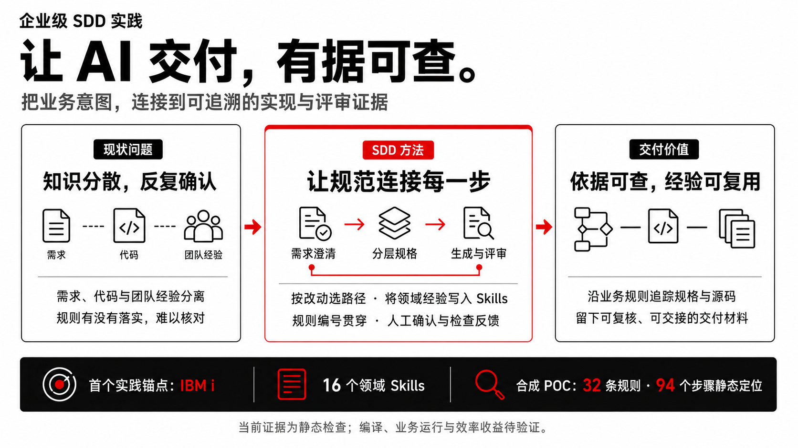

# Atlas Engineering Delivery Hub - Build

**简体中文** | [English](README.en.md)

[交付案例库](docs/cases/README.md) | [参赛提交材料](docs/open-collaboration-submission.zh-CN.md) | [完整技能参考](docs/full-reference-readme.md) | [中文交互路演](docs/presentations/README.md)



**企业级 SDD（规范驱动开发）交付实践：将业务需求、系统知识和工程约束，转化为可追溯、可评审、可验证的交付过程。**

IBM i 是首个深入实践场景，当前提供 16 个领域 Skills 和合成 POC 证据。项目探索可迁移的交付方法；其他技术环境的适配与验证尚未完成。

## Situation：为什么要做？

企业软件的长期演进积累了业务规则、系统依赖和团队约定。我们关注的问题是：如何让 AI 使用这些依据生成实现，并让评审者能够核对规则是否落实？

在首个 IBM i 实践场景中，一次改动需要理解现有源码、核对文件和调用，并保持维护习惯。[既有 Pilot 复盘](article-pilot-retrospective.md)记录了三个使用问题：小改动被要求先走完整文档链；生成的 fixed-format 代码缺少惯用的分隔、注释和命名；旧代码理解与测试准备缺少衔接。这些反馈构成了本项目调整工作流的依据，实际成本尚未量化。

## Solution：如何解决？

- **按范围选择路径：** 上下文明确的小型变更保留必要规格与检查；新建或范围不明的工作先补齐需求和设计依据。
- **把领域经验写入依据：** 结合既有系统知识、处理步骤、接口与数据契约，以及团队维护约定，指导生成和评审。
- **随实现交付检查证据：** 保留 BR 编号及跨规格引用，用评审规则、静态检查和人工判断核对产物。

这三项机制组成企业级 SDD 的实践方法。首个 IBM i 实现将它们落实为 Mini Requirement → Program Spec 短路径、程序／文件契约以及 RPGLE、CLLE 与 DDS 的生成评审规则。其目标是减少重复理解和修正投入，让维护经验可复用；效果将通过真实案例对比检验。

## Result：已经做到了什么？

[完整合成 POC](docs/cases/rpgle-flow-poc/README.md)已形成需求、设计、8 份程序规格、24 份文件规格和 35 个源码文件。32 条业务规则可关联到规格步骤与源码，94 个步骤有静态定位，并保留了检查和修正记录。评审者可以沿规则查看实现依据，其他人可以本地复核当前静态材料。

目前没有 IBM i 编译、业务运行或实测效率收益；产物数量和静态定位不代表业务正确率。下一步将通过脱敏真实案例测量**总人工投入、返工和交接质量**。

[完整 Situation → Solution → Result 主线与收益测量方法](docs/atlas-engineering-delivery-hub-build-pitch.md)是价值叙事的维护入口；[案例库](docs/cases/README.md)保存证据。


## 方法与领域实践

| 层次 | 作用 | 当前状态 |
| --- | --- | --- |
| 企业交付问题 | 理解上下文、控制变更范围、核对规则落点 | 由 Pilot 反馈和案例问题提供具体依据 |
| SDD 实践方法 | 分层规格、显式契约、规则追踪、人工确认与验证反馈 | 已形成协议、模板和评审规则 |
| 领域实现 | 将方法落实为具体生成与检查能力 | 首个 IBM i 实现；其他技术栈待适配和验证 |

迁移到新领域需要补齐该领域的契约、生成规范、评审规则和验证工具，再通过案例检验。详见[领域扩展路线](docs/atlas-engineering-delivery-hub-build-pitch.md#领域扩展路线)。

## 当前交付范围

本仓库是 Atlas Engineering Delivery Hub / Seven Mountains SDLC 中的 **M4 Build 工具**。上游 M3 Discovery（例如 Atlas Phoenix Lens / Legacy Spec Factory）可提供发现与设计证据，Build 继续形成实现及测试准备材料，供下游 M5 Testing 使用。

```text
M1 Planning -> M2 Estimation -> M3 Discovery -> [M4 Build] -> M5 Testing -> M6 Deployment -> M7 Maintenance
```

仓库当前提供 `.claude/` 下的 **16 个 IBM i Claude Code Skills**，覆盖两条互相衔接的交付链：

- **Program Chain：** 需求/设计证据 -> Program Spec -> RPGLE/CLLE 源码 -> 编译预检查 -> 代码评审 -> 单元测试计划 -> SQL/CL 测试脚手架。
- **File Chain：** 技术设计/文件需求 -> 带 Markdown + JSON 双层输出的 File Spec -> PF/LF/PRTF/DSPF DDS 源码 -> DDS 评审。
- **分析与编排：** 现有源代码分析、变更影响分析、规格评审，以及支持 `task.md` 的计划与批准后批量执行。

这个仓库包含技能定义、参考文档、示例、图表、半自动测试脚本，以及附有源码草案和验证证据的交付案例。它不包含应用服务器、IBM i 连接器，也不负责自动部署。

## 交付案例

[案例库](docs/cases/README.md)已收录[多仓订单履约与结算 POC](docs/cases/rpgle-flow-poc/README.md)，从 `rpgle-migration-benchmark` 的固定提交纳入。仓库内可直接阅读完整需求、技术设计、8 份程序规格、24 份文件规格、35 个源码文件、静态审查记录及冻结的四类 Flow 评测材料。

这是一个完全虚构的合成案例，展示 Skills 从需求到源码草案及静态检查的使用过程。当前没有 IBM i 编译、业务运行、模型评测或效率收益对比结果。后续脱敏真实案例使用[统一案例模板](docs/cases/case-template.md)，分别记录业务来源和实际验证证据。

## 核心能力


[查看可缩放 SVG](docs/assets/atlas-build-skill-map.zh-CN.svg) · [图示说明与维护依据](docs/assets/atlas-build-skill-map.zh-CN.md)。图中列出当前已有的 16 个 Skills；按范围选择路径，小改动满足准入条件时可从 Mini Requirement 进入程序规格。测试准备可并行开展，图示不代表 POC 已执行全部步骤。

| 领域 | Skills | 当前能力 |
|------|--------|----------|
| 输入整理与分析 | `ibm-i-requirement-normalizer`, `ibm-i-program-analyzer`, `ibm-i-impact-analyzer` | 整理混乱输入，理解现有 RPGLE/CLLE 源码，分析变更影响。 |
| 规格生成 | `ibm-i-functional-spec`, `ibm-i-technical-design`, `ibm-i-program-spec`, `ibm-i-file-spec` | 生成分层规格文档，保留 BR-xx 业务规则追踪，处理 TBD 和推断信息。 |
| 构建产物生成 | `ibm-i-code-generator`, `ibm-i-dds-generator` | 从 Program Spec 生成 RPGLE/CLLE，从 File Spec JSON 生成 DDS。 |
| 质量门禁 | `ibm-i-compile-precheck`, `ibm-i-spec-reviewer`, `ibm-i-dds-reviewer`, `ibm-i-code-reviewer` | 检查编译安全、规格质量、DDS 与规格一致性、代码与规格一致性。 |
| 开发者测试 | `ibm-i-ut-plan-generator`, `ibm-i-test-scaffold` | 生成单元测试计划，以及 setup/compile/execute/verify/cleanup 的 SQL/CL 测试脚手架。 |
| 工作流编排 | `ibm-i-workflow-orchestrator` | 判断下一步使用哪个 Skill，也可以生成和执行已批准的 `task.md` 批处理计划。 |

## 输入与输出

常见输入包括：

- 原始需求、工单、邮件、会议记录、Mini Requirement。
- 现有 RPGLE/CLLE 源码和变更请求。
- Functional Spec、Technical Design、Program Spec、File Spec 或 File Spec JSON。
- IBM i 开发的单元测试计划或测试场景。

常见输出包括：

- 结构化需求包。
- Functional Spec、Technical Design、Program Spec、File Spec。
- RPGLE/CLLE 源码草稿和 DDS 源码。
- 编译预检查、规格评审、代码评审、DDS 评审报告。
- 单元测试计划和 SQL/CL 测试脚手架。
- 带目标产物、门禁、执行日志、开放问题和最终清单的 `task.md`。

## 工作方式

M4 Build 的核心不是“自动生成一切”，而是让每一步都有清晰证据来源和边界。

1. **先判断当前证据在哪一层。** Orchestrator 会识别输入是原始需求、设计证据、现有源码、规格、生成代码还是测试计划。
2. **只从正确的源头生成。** Code Generator 只能从 Program Spec 生成代码；DDS Generator 只能从 File Spec JSON 生成 DDS；Review Skills 只评审，不改写。
3. **保持可追踪。** BR-xx 编号跨层延续；File Spec 提供稳定 ID，便于 Program Spec 引用文件和字段。
4. **不确定就标注，不编造。** 未确认的对象名、文件布局和设计事实，用 `TBD` 或显式推断标记保留。
5. **保留人工门禁。** Plan 审批、Spec Approval Gate、Critical 评审发现和阻塞性 TBD 都是明确停点。

架构图：

- [生命周期定位图](docs/assets/atlas-build-lifecycle.mmd)
- [内部工作流图](docs/assets/atlas-build-internal-workflow.mmd)
- [上下游关系图](docs/assets/atlas-build-upstream-downstream.mmd)

## 快速开始

1. 克隆本仓库。
2. 将 `.claude/` 复制到使用 Claude Code Skills 的 IBM i 交付仓库中，或者把本仓库作为技能参考工作区。
3. 根据手头已有的材料选择入口：

```text
原始需求 -> ibm-i-requirement-normalizer
只有现有源码 -> ibm-i-program-analyzer
现有源码 + CR -> ibm-i-impact-analyzer
Technical Design -> ibm-i-program-spec 和/或 ibm-i-file-spec
Program Spec -> ibm-i-code-generator, ibm-i-ut-plan-generator
File Spec JSON -> ibm-i-dds-generator
生成后的源码 -> compile/code/DDS review skills
不确定下一步 -> ibm-i-workflow-orchestrator
```

4. 如果需要批量执行，让 Orchestrator 基于已批准的 Program Spec 或 Technical Design 生成 `task.md`。人工审阅并批准后，再进入 Execute Mode。
5. 将评审报告、测试脚手架和最终 manifest 作为 M5 Testing 的交接证据。

## 示例流程

```text
M3 Discovery evidence
  -> Technical Design
  -> ibm-i-workflow-orchestrator Plan Mode
  -> approved task.md
  -> Program Spec and File Spec generation
  -> human Spec Approval Gate
  -> RPGLE/CLLE and DDS generation
  -> compile precheck, code review, DDS review
  -> UT Plan and SQL/CL test scaffold
  -> M5 Testing handoff
```

一个脱敏的最小示例包放在 [docs/samples/atlas-build-tool-mini-output/](docs/samples/atlas-build-tool-mini-output/)。

完整产物演示可沿[POC 的 Demo 阅读路径](docs/cases/rpgle-flow-poc/README.md#建议的-demo-阅读路径)展开。该案例记录到源码草案和静态检查阶段，上述 UT 与脚手架阶段尚未在此案例执行。

## 目录概览

```text
.claude/                                  # 16 个 IBM i Claude Code Skills
docs/assets/                              # Mermaid 架构和设计图
docs/cases/                               # 交付案例、证据与后续案例模板
docs/cases/rpgle-flow-poc/                 # 合成 POC 的固定产物与评测包
docs/samples/atlas-build-tool-mini-output/ # 脱敏示例包
docs/full-reference-readme.md             # 保留的原始完整技术 README
docs/open-collaboration-submission.md     # 英文参赛提交材料
docs/open-collaboration-submission.zh-CN.md # 中文参赛提交材料
docs/atlas-engineering-delivery-hub-build-index.md # 评审导航索引
docs/atlas-engineering-delivery-hub-build-pitch.md # 简短 Pitch 和 Demo 讲述稿
OpenCode_IBMi_Skill_Family.pptx           # 已有演示材料
```

## 关键文档

- [交付案例库](docs/cases/README.md)
- [评审导航索引](docs/atlas-engineering-delivery-hub-build-index.md)
- [英文提交材料](docs/open-collaboration-submission.md)
- [中文提交材料](docs/open-collaboration-submission.zh-CN.md)
- [Pitch 与 Demo Story](docs/atlas-engineering-delivery-hub-build-pitch.md)
- [贡献指南](CONTRIBUTING.md)
- [原始完整技能参考](docs/full-reference-readme.md)
- [Workflow Orchestrator Skill](.claude/ibm-i-workflow-orchestrator/SKILL.md)
- [Task.md Template](.claude/ibm-i-workflow-orchestrator/references/task-md-template.md)
- [Task.md Execution Protocol](.claude/ibm-i-workflow-orchestrator/references/task-md-execution-protocol.md)

## 验证与测试脚本

三个技能包含半自动测试脚本：

- `.claude/ibm-i-dds-generator/tests/runner.sh`：31 个 DDS 用例。
- `.claude/ibm-i-code-generator/tests/runner.sh`：8 个代码生成用例。
- `.claude/ibm-i-test-scaffold/tests/runner.sh`：6 个测试脚手架用例。

这些脚本会调用 `claude` CLI 生成内容，再用结构规则检查输出。它们适合做 Skill 行为回归测试，但需要已认证的 Claude CLI，并且会消耗模型调用。

已收录 POC 另有本地复核工具，仅需 Python 3.9+，不调用模型：

```bash
python3 docs/cases/rpgle-flow-poc/snapshot/tools/validate_static_source.py
python3 docs/cases/rpgle-flow-poc/snapshot/tools/prepare_benchmark.py --check
```

第一条会重写案例内的静态检查 JSON，第二条只读检查冻结评测包。检查范围是该案例的结构、契约、追踪和打包完整性，不代表 IBM i 编译或业务测试。证据边界及快照维护方式见[案例说明](docs/cases/rpgle-flow-poc/README.md)。

## 证据、追踪与人工评审

这个工具面向受控构建，而不是盲目自动化。它保留上游证据、延续 BR-xx 追踪、标注假设，并在范围或实现风险较高的位置设置人工门禁。所有生成的 RPGLE/CLLE 和 DDS 在编译、集成或生产使用前，都应由具备 IBM i 经验的开发者审阅。

## 路线图

近期适合共建的方向：

- 在合成 POC 基础上增加脱敏真实交付案例和实测效果。
- 扩展 Orchestrator 的 `task.md` 计划和 TD-driven 批处理测试覆盖。
- 如果团队统一 Mermaid 渲染方式，补充 SVG/PNG 图表版本。
- 增加 compile-precheck、DDS review、code review 的边界案例示例。
- 补充 Claude Code 与 Codex 混合使用时的迁移说明。

更长期的想法：

- 沉淀可复用的 M4 Build 证据包模板。
- 增加可选 CI 检查，包括 Markdown 链接和测试脚本 dry run。
- 探索向 M5 Testing 交接的安全适配方式，但不在本仓库中引入部署和凭证处理。

## 贡献

欢迎企业开发者、业务分析师、架构师、测试人员和 AI 工作流维护者参与，贡献真实案例与新的领域适配。开始前请阅读 [CONTRIBUTING.md](CONTRIBUTING.md)，新增 Build pattern 或模板时要保证证据清晰、数据脱敏、可评审。

## License

See [LICENSE](LICENSE).
